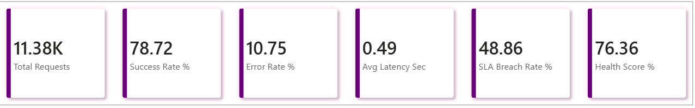
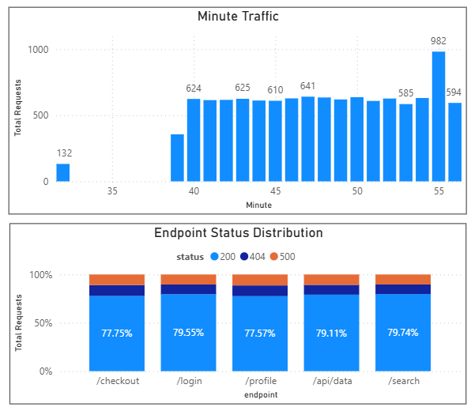
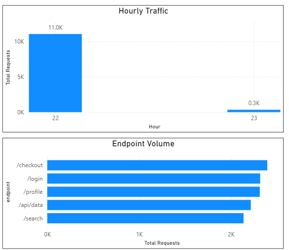

# 🚀 API Performance Monitoring & Analytics System

End-to-end **API performance monitoring system** built using **Python (ETL), MySQL, and Power BI** to track system health, detect SLA breaches, and analyze latency (P95/P99).

👉 **Pipeline:** Logs → ETL → MySQL → Analytics → Dashboard

---

## 🎯 Why This Project Matters

Modern systems generate massive API logs, but:

* Data is **noisy and inconsistent**
* Poor quality leads to **wrong insights**
* Performance issues stay **hidden without monitoring**

👉 This project solves that by building a **production-style monitoring pipeline**

---

## 🧠 What This Project Demonstrates

* Full **end-to-end data pipeline ownership**
* Strong **data quality engineering (validation + rejection handling)**
* Real-world **performance monitoring (latency, SLA, errors)**
* **SQL optimization & indexing** with measurable improvement
* Business-ready **dashboard reporting (Power BI)**

---

## ⚡ Key Highlights

✔ Built ETL pipeline using Python + MySQL
✔ Simulated real-world API logs (latency, errors, retries)
✔ Implemented data validation & rejected data tracking
✔ Designed SLA monitoring + P95/P99 latency analysis
✔ Created automated alert logic using SQL triggers
✔ Wrote **40+ SQL queries** (KPI → diagnostics)
✔ Built interactive Power BI dashboard

---

## 🔄 System Architecture

```
Log Simulator (Python)
        ↓
Raw Logs (CSV)
        ↓
ETL Pipeline (Validation + Cleaning)
      ↙                 ↘
Valid Data           Rejected Data
(api_logs)           (rejected_logs)
      ↓                   ↓
   MySQL              Debug Layer
        ↓
SQL Analytics Layer
(KPI → Advanced → Diagnostics)
        ↓
Power BI Dashboard
```

---

## 📊 Results & Impact

* Processed **100,000+ API log records**
* Improved **data quality via validation pipeline**
* Identified **SLA breaches & high-latency endpoints**
* Reduced query execution time using **indexing & optimization**

---

## 🧮 Key Metrics Tracked

| Metric       | Description             |
| ------------ | ----------------------- |
| Success Rate | API reliability         |
| Error Rate   | Failure tracking        |
| Avg Latency  | Performance measurement |
| P95 / P99    | Tail latency analysis   |
| SLA Breach   | Threshold violations    |
| Health Score | Overall system status   |

---

## ⚙️ Tech Stack

* **Python** → Log simulation & ETL pipeline
* **MySQL** → Data storage & analytics
* **Power BI** → Visualization & dashboard

---

## 📸 Dashboard Preview

### 📊 Key Performance Indicators (KPIs)


### 📈 Traffic Analysis & Status Distribution


### 🚀 Hourly Traffic & Endpoint Volume


**Insights Delivered:**

* SLA breach trends
* High latency endpoints
* Error spikes detection
* System health monitoring

---

## 🌍 Real-World Applications

* API monitoring systems
* SLA compliance tracking
* Observability platforms
* Production log analytics

👉 Comparable to systems used in **Amazon / Netflix / Google**

---

## 🚀 Quick Start

### 1. Setup Database

```sql
source sql/00_schema_setup.sql;
```

### 2. Run Log Simulator

```bash
python scripts/log_simulator.py
```

### 3. Run ETL Pipeline

```bash
python scripts/etl_pipeline.py
```

### 4. Execute SQL Analytics

The `sql/` folder contains several scripts for different analytical purposes:
- `01_kpi_queries.sql`: High-level business metrics (Success Rate, SLA).
- `02_advanced_analytics.sql`: Latency analysis (P95, P99) and trend tracking.
- `03_diagnostic_queries.sql`: Identifying specific failure points and high-latency endpoints.
- `04_alert_triggers.sql`: Automated SQL triggers for incident detection.

### 5. Open Dashboard

Load `dashboard/performance_monitoring.pbix` in Power BI to visualize the results.

---

## 🔮 Future Enhancements

* Real-time streaming (Kafka)
* API ingestion layer
* Alert integration (Email / Slack)
* Advanced performance tuning engine

---

## 👨‍💻 Author

**Karthick Raja**
*Aspiring Data Analyst | SQL • ETL • Performance Analytics*

[](https://www.linkedin.com/in/karthick-raja-l-7a5b3a26b/)
[](https://github.com/KarthickRaja46)
[](mailto:karthiikarthii46@gmail.com)

---
